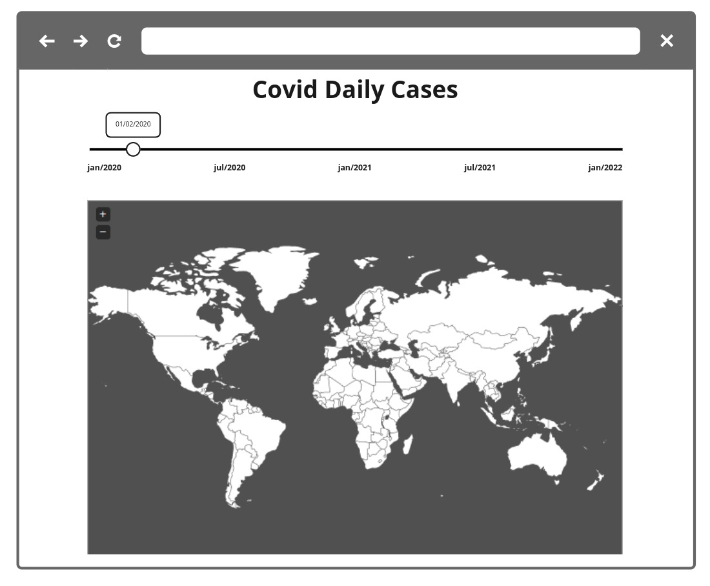

# Fullstack Challenge 🏅 2022 - Covid Daily Cases

## Introdução

Este é um desafio para que possamos ver as suas habilidades como Fullstack Developer.

Nesse desafio você deverá desenvolver uma REST API que utilizará o histórico de casos de Covid, [disponível no Kaggle](https://www.kaggle.com/yamqwe/omicron-covid19-variant-daily-cases). Caso não seja possível fazer o download, utilize o arquivo CSV neste link [https://challenges.coode.sh/covid/data/covid-variants.csv](https://challenges.coode.sh/covid/data/covid-variants.csv).

Também deverá desenvolver um projeto front-end para consumir as informações da sua API.

O projeto a ser desenvolvido por você tem como objetivo exibir o número de casos por país, dia e variante. Para isso será necessário gerar um gráfico que mostre o mapa mundi. Atente-se, ao desenvolver a aplicação front-end, para conceitos de usabilidade e adeque a interface com elementos visuais para os usuários do seu sistema.

[SPOILER] As instruções de entrega e apresentação do challenge estão no final deste Readme (=

### Instruções iniciais obrigatórias

- Trabalhar em um repositório em seu usuário ou utilizar o seu github pessoal (não esqueça de colocar no readme a referência a este challenge);
- O projeto **back-end** deverá ser desenvolvido com uma das tecnologias a seguir: **Node.js | C# .NET Core | PHP Laravel | RubyOnRails | Go Lang | Python FastAPI | SpringBoot Kotlin | Rust**;
- O projeto **front-end** deverá ser desenvolvido com uma das tecnologias a seguir: **React.js | Vue.js | Angular 8+**;
- Criar um banco de dados grátis **MongoDB** usando Atlas: https://www.mongodb.com/cloud/atlas ou banco de dados grátis **MySQL** no Heroku: https://elements.heroku.com/addons/jawsdb ou banco de dados grátis **Postgres** no Heroku: https://elements.heroku.com/addons/heroku-postgresql; (Recomendável usar Drivers oficiais para integração com o DB)

### Modelo de Dados:

Para a definição do modelo consulte os campos presentes no arquivo a ser importado; você pode ver a estrutura como o exemplo:

```json
{
    "location": "string",
    "date": "date",
    "variant": "string",
    "num_sequences": "number",
    "perc_sequences": "number",
    "num_sequences_total": "number",
  }
```

### Back-End:

Nessa etapa você deverá construir uma API Restful com as melhores práticas de desenvolvimento. Para isso você deve executar os passos a seguir:

**Obrigatório 1** - Você deverá desenvolver as seguintes rotas:

- `[GET]/`: Retornar um Status: 200 e uma Mensagem "Fullstack Challenge 2021 🏅 - Covid Daily Cases"
- `[GET]/cases/:date/count`: Listar todos os registros da base de dados no dia selecionado, agrupados por país e separados por variante.
- `[GET]/cases/:date/cumulative`: Listar todos os registros da base de dados, retornando a soma dos casos registrados de acordo com a data selecionada, agrupados por país e separados por variante.
- `[GET]/dates`: Listar as datas disponíveis no dataset

**Obrigatório 2** - Para alimentar o seu banco de dados você deve criar um script para armazenar os dados do arquivo CSV que o Kaggle disponibiliza.

**Diferencial 1** - Configurar Docker no Projeto para facilitar o Deploy da equipe de DevOps;

**Diferencial 2** - Escrever Unit Tests para os endpoints da API;

**Diferencial 3** - Descrever a documentação da API utilizando o conceito de Open API 3.0;

**Diferencial 4** - Usar a [Kaggle API](https://github.com/Kaggle/kaggle-api) para baixar os arquivos do dataset. Lembrando que esta biblioteca roda com Python, então será necessário conferir se o ambiente pode executar a biblioteca;

**Diferencial 5** - Salvar em cache o resultado dos endpoints, para agilizar a resposta em caso de buscas com parâmetros repetidos

**Diferencial 6** - Utilizar aggregate para calcular os dados cumulativos

### Front-End:

Nessa etapa você deverá desenvolver uma aplicação web para consumir a API que você criou.

Para o desenvolvimento você pode utilizar algum framework CSS ou criar seu proprio estilo, recomendamos:
- Tailwind CSS: https://tailwindcss.com/
- Material UI: https://material-ui.com/
- Angular Material: https://material.angular.io/
- Bootstrap: https://getbootstrap.com/
- Bulma: https://bulma.io/
- Ou escrever o seu proprio sob medida 👌

Para desenhar o [Mapa coroplético
](https://pt.wikipedia.org/wiki/Mapa_coropl%C3%A9tico), use alguma destas bibliotecas ou outra de sua preferência:
- https://github.com/bjornd/jvectormap
- https://github.com/sgratzl/chartjs-chart-geo
- https://github.com/plotly/plotly.js

#### Wireframe

  

**Obrigatório 1** - Seguir o wireframe para a página de listagem dos dados;

**Obrigatório 2** - Deve conter uma opção para alterar entre as datas disponíveis

**Obrigatório 3** - Desenvolver um select para que seja possível escolher entre exibir os dados de uma data ou os dados acumulados até aquela data

**Obrigatório 4** - Ao passar o mouse sobre um país, exiba seu nome e a quantidade de casos de cada variante registrados naquela data

**Diferencial 1** - Escrever Unit Tests ou E2E Test. Escolher a melhor abordagem e biblioteca;

**Diferencial 2** - Configurar Docker no Projeto para facilitar o Deploy da equipe de DevOps;

**Diferencial 3** - Colocar na URL os parametros utilizados na busca, para que seja possível compartilhar a URL;

**Diferencial 4** - Implementar SSR no projeto;

**Diferencial 5** - Adicionar um botão de "play" para exibir a evolução das dados automaticamente.

**Diferencial 6** - Publique o projeto em alguma plataforma, como por exemplo a [Vercel](https://vercel.com/), [Netflify](https://www.netlify.com/) ou outra de sua preferência.

## Readme do Repositório

- Deve conter o título do projeto
- Uma descrição sobre o projeto em frase
- Deve conter uma lista com linguagem, framework e/ou tecnologias usadas
- Como instalar e usar o projeto (instruções)
- Não esqueça o [.gitignore](https://www.toptal.com/developers/gitignore)
- Se está usando github pessoal, referencie que é um challenge by coodesh:  

>  This is a challenge by [Coodesh](https://coodesh.com/)

## Finalização e Instruções para a Apresentação

Avisar sobre a finalização e enviar para correção.

1. Confira se você respondeu o Scorecard da Vaga que chegou no seu email;
2. Confira se você respondeu o Mapeamento Comportamental que chegou no seu email;
3. Acesse: [https://coodesh.com/challenges/review](https://coodesh.com/challenges/review);
4. Adicione o repositório com a sua solução;
5. Grave um vídeo, utilizando o botão na tela de solicitar revisão da Coodesh, com no máximo 5 minutos, com a apresentação do seu projeto. Foque em pontos obrigatórios e diferenciais quando for apresentar.
6. Adicione o link da apresentação do seu projeto no README.md.
7. Verifique se o Readme está bom e faça o commit final em seu repositório;
8. Confira a vaga desejada;
9. Envie e aguarde as instruções para seguir no processo. Sucesso e boa sorte. =)

## Suporte

Use o nosso canal no slack: http://bit.ly/32CuOMy para tirar dúvidas sobre o processo ou envie um e-mail para contato@coodesh.com.

